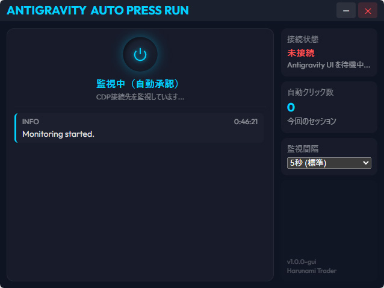

# Antigravity Auto Press Run GUI

**Antigravity Auto Press Run GUI** は、AI コーディングアシスタント「Antigravity（VSCode 拡張機能）」が表示する許可確認ボタン（`Allow Once`・`Run` など）を自動でクリックし、開発の自動化をサポートするデスクトップアプリケーションです。

軽量なスクリプト版から進化したこの GUI 版は、より直感的で、かつ実行状況が視覚的にわかりやすい設計になっています。

---

> [!CAUTION]
> ## ⚠️ 重大な警告：本ツールの使用には極めて高いリスクが伴います
>
> 本ツールは Antigravity が求める**すべての操作許可をあなたの代わりに「無条件・無検閲」で自動承認**します。
>
> これは、AIのアシスタントが以下のような**取り返しのつかない破壊的・危険な操作を提案した場合でも、一切の確認なしに即座に実行されてしまう**ことを意味します。
>
> - **プロジェクト全体の削除・全ファイルの白紙化**
> - **管理者権限が必要なシステムコマンドの勝手な実行**
> - **環境変数や `.env` ファイルなどに含まれる API キー・個人情報の外部送信**
> - **外部ネットワークへの意図しないアクセスや悪意ある通信**
>
> **【安全にご使用いただくための鉄則】**
> - **バックアップの徹底**: 重要なファイルやデータベースは、必ず実行前にバックアップを確保してください。
> - **信頼できる作業時のみ起動**: 自分が把握していない大規模な自動生成や、複雑なタスクを AI に依頼している間は使用を控えてください。
> - **目を離さない**: 可能な限りツールが何をクリックし、AI が何を実行しているかを監視してください。
> - **本番環境での使用禁止**: 本番サーバーや顧客データが存在する環境では、**絶対に**本ツールを使用しないでください。
>
> **本ツールの使用によって生じたいかなる損害（データ喪失、システム破壊、情報の流出等）についても、開発者は一切の責任を負いません。すべてはユーザーの自己責任において使用されるものとします。**

---

## 💎 特徴


- **黒窓（コマンドプロンプト）なし**: 実行時に邪魔なデバッグ画面が表示されません。
- **直感的な操作パネル**: ON/OFF の切り替えがボタンひとつで可能です。
- **柔軟な監視インターバル**: 状況に応じて 30秒〜60分 の間で監視間隔を即座に変更できます。
- **リアルタイムログ**: 「どのボタンをいつ、どんな文脈でクリックしたか」をGUI上でリアルタイムに監視できます。
- [x] ポータブル設計: インストール不要。フォルダを置くだけでどこでも動作します。

<br clear="right">

### 📱 アプリ画面


## おすすめの導入方法

antigravityのAIチャットに以下のプロンプトを入力してください。
「https://github.com/harunamitrader/antigravity_auto_press_run_gui を導入して。可能な範囲でAI側で作業を行い、必要な情報があれば質問して。手動で行う必要があるものは丁寧にやり方を教えて。」

導入が完了したら、
「デバッグモード用ショートカットとantigravity_auto_press_run_guiの起動用ショートカットをデスクトップに作成して」
も必要に応じてプロンプトを送信しても良いかもしれません。

導入方法でわからないことやエラーがあれば都度antigravityのAIチャットで質問すればどうにか導入できるはずです。

## 🚀 導入・使用ガイド


このツールを使うには、まず **「AntigravityのAIチャット欄と通信できる状態」** にする必要があります。以下の 1〜3 のステップに従ってください。

### STEP 1：VSCode を「デバッグモード」で開く設定

このアプリは VSCode の裏側に接続してボタンを探します。そのためには、VSCode を起動する際に専用の「通り道」を作る設定が必要です。

1. デスクトップなどにある **「Antigravity」のショートカットアイコン** を右クリックします。
2. **「プロパティ」** をクリックします。
3. **「ショートカット」タブ** の **「リンク先」** という項目の末尾に、**半角スペースを1つ空けてから** 以下の文字を付け足します。
   ` --remote-debugging-port=9222`
   - 正しい例：`"C:\...\Antigravity.exe" --remote-debugging-port=9222`
4. **「OK」** を押して閉じます。
5. **そのショートカットから Antigravity を起動します。** （すでに開いている場合は一度閉じてから、設定したショートカットで開き直してください）

### STEP 2：アプリ本体の準備

1. 本リポジトリ右側の **[Releases]** から最新の Zip ファイル（`antigravity_auto_press_run_gui_v1.0.0.zip` など）をダウンロードします。
2. ダウンロードしたファイルを右クリックして **「すべて展開（解凍）」** します。
3. 展開されたフォルダの中にある **`Antigravity Auto Press Run.exe`** （⚡️アイコンのファイル）をダブルクリックして起動します。

### STEP 3：自動実行の開始

1. アプリが起動したら、左側のメニューから **「監視インターバル（チェックする間隔）」** を選びます。
   - **おすすめ：15秒** （パソコンへの負荷が少なく、かつスムーズに進行します）
2. 画面中央の大きな **電源ボタン（丸いボタン）** をクリックして **「ON」** にします。
3. これで準備完了です！VSCode で Antigravity が「Allow Once」や「Run」などの確認ボタンを出した瞬間、このアプリが自動でそれを検知してクリックします。

---

## 🛠 開発者・上級者向けビルド方法

ソースコードから自分でビルドしたい場合は、Node.js がインストールされた環境で以下を実行してください。

```bash
# 依存関係のインストール
npm install

# 開発モード（UIの修正など）
npm run dev

# ポータブル版 (.exe フォルダ) のビルド
npm run package
```

## ⚖️ 免責事項

本ツールは学習および業務効率作業の補助を目的として作成されています。
本ツールがいかなる環境でも正確に動作することを保証するものではありません。対象サービスの利用規約を遵守し、常に細心の注意を払って使用してください。

---
MIT License © harunamitrader
